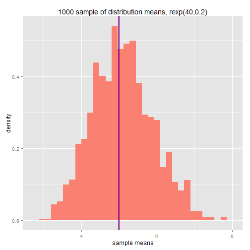

Statistical Inference Project Part1 Simulation Exercise
========================================================
Created By Trent Lin Oct. 25 2014

## Basic Setting

```r
echo = TRUE # always make code visible
error = FALSE
library(ggplot2)
library(plyr)
```

## Simulations
The exponential distribution can be simulated in R with rexp(n, lambda) where lambda($\lambda$) is the rate parameter. The mean of exponential distribution is $1/\lambda$ and the standard deviation is also $1/\lambda$. For this simulation, we set $\lambda=0.2$. In this simulation, we investigate the distribution of averages of 40 exponential(0.2)s.
Lets start by doing a thousand simulated averages of 40 exponentials.

```r
lambda = 0.2; n = 40; simulation=1000; mu = 1/lambda; sigma = 1/lambda;
```
Then, create a sample distribution using rexp, and calculate the sample means and sample standard deviation.

```r
sample_dist <- sapply(1:simulation, FUN=function(x) { mean(rexp(n, lambda))})
sd_mean <- mean(sample_dist)
sd_stddev <- sd(sample_dist)
df <- data.frame(mns=sample_dist) #gglot need to input dataframe 
```

Now we answering the following question
## 1.Show where the distribution is centered at and compare it to the theoretical center of the distribution.

```r
g <- ggplot(df, aes(x=mns, weight=mns/sum(mns)))
g + geom_histogram(aes(y=..density..),fill = "salmon") +
  geom_vline(xintercept = sd_mean, colour = "blue") + 
  geom_vline(xintercept = 5, colour = "Red" ) +
  labs(title = "1000 sample of distribution means, rexp(40,0.2)",x ="sample means",y="density")
```

```
## stat_bin: binwidth defaulted to range/30. Use 'binwidth = x' to adjust this.
```

 

We show the theoretical mean in red, and the mean of the sample distribution in blue. They are nearly identical.

## 2.Show how variable it is and compare it to the theoretical variance of the distribution.

standard deviation of distribution of averages of 40 exponentials

```r
sd(sample_dist)
```

```
## [1] 0.7965
```
standard deviation from analytical expression

```r
(1/lambda)/sqrt(n)
```

```
## [1] 0.7906
```
Variance of the sample mean

```r
var(sample_dist)
```

```
## [1] 0.6344
```
Theoritcal variance of the distribution

```r
1/((0.2*0.2) * 40)
```

```
## [1] 0.625
```

Therefore, the variability in distribution of averages of 40 exponentials is close to the theoretical variance of the distribution.

## 3.Show that the distribution is approximately normal.

```r
g <- ggplot(df, aes(x=mns, weight=mns/sum(mns)))
g + geom_histogram(aes(y=..density..),fill = "salmon") +
  geom_vline(xintercept = sd_mean, colour = "blue") + 
  geom_vline(xintercept = 5, colour = "Red") +
  labs(title = "1000 sample of distribution means, rexp(40,0.2)",x ="sample means",y="density") +
  geom_density(fill=NA,colour="black",size = 1)
```

```
## stat_bin: binwidth defaulted to range/30. Use 'binwidth = x' to adjust this.
```

 

The distribution of sample means approximate normal distribution line

## 4.Evaluate the coverage of the confidence interval for $1/\lambda = \bar{X} \pm 1.96 \frac{S}{\sqrt{n}}$.
The 97.5% confidenct interval for sample means is

```r
mean(sample_dist) + c(-1,1)*qnorm(0.975)*sd(sample_dist)/sqrt(n)
```

```
## [1] 4.723 5.217
```

