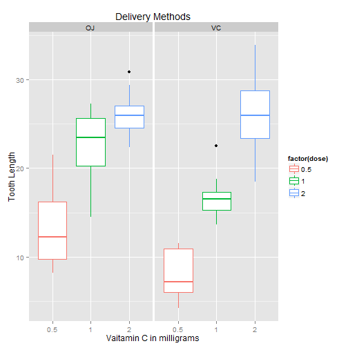

Statistical Inference Project Part2 Simulation Exercise
========================================================
Created By Trent Lin Oct. 26 2014

In Second portion of this project, we're going to analyze the ToothGrowth
data in the R datasets package

## Basic setting

```r
library(ggplot2)
echo = TRUE
```

## 1.Load the ToothGrowth data and perform some basic exploratory data   analysis


```r
# load the dataset ToothGrowth
library(datasets)
data(ToothGrowth)
```


```r
# Look at the dataset variables
head(ToothGrowth)
```

```
##    len supp dose
## 1  4.2   VC  0.5
## 2 11.5   VC  0.5
## 3  7.3   VC  0.5
## 4  5.8   VC  0.5
## 5  6.4   VC  0.5
## 6 10.0   VC  0.5
```

```r
tail(ToothGrowth)
```

```
##     len supp dose
## 55 24.8   OJ    2
## 56 30.9   OJ    2
## 57 26.4   OJ    2
## 58 27.3   OJ    2
## 59 29.4   OJ    2
## 60 23.0   OJ    2
```

```r
str(ToothGrowth)
```

```
## 'data.frame':	60 obs. of  3 variables:
##  $ len : num  4.2 11.5 7.3 5.8 6.4 10 11.2 11.2 5.2 7 ...
##  $ supp: Factor w/ 2 levels "OJ","VC": 2 2 2 2 2 2 2 2 2 2 ...
##  $ dose: num  0.5 0.5 0.5 0.5 0.5 0.5 0.5 0.5 0.5 0.5 ...
```


```r
# converse dose from num to factor
ToothGrowth$dose <- as.factor(ToothGrowth$dose)
```


```r
# review the dataset variables
str(ToothGrowth)
```

```
## 'data.frame':	60 obs. of  3 variables:
##  $ len : num  4.2 11.5 7.3 5.8 6.4 10 11.2 11.2 5.2 7 ...
##  $ supp: Factor w/ 2 levels "OJ","VC": 2 2 2 2 2 2 2 2 2 2 ...
##  $ dose: Factor w/ 3 levels "0.5","1","2": 1 1 1 1 1 1 1 1 1 1 ...
```

## 2.Provide a basic summary of the data.


```r
# summary statistics for all variables
summary(ToothGrowth)
```

```
##       len       supp     dose   
##  Min.   : 4.2   OJ:30   0.5:20  
##  1st Qu.:13.1   VC:30   1  :20  
##  Median :19.2           2  :20  
##  Mean   :18.8                   
##  3rd Qu.:25.3                   
##  Max.   :33.9
```


```r
# split of cases between different dose levels and delivery methods
table(ToothGrowth$supp, ToothGrowth$dose)
```

```
##     
##      0.5  1  2
##   OJ  10 10 10
##   VC  10 10 10
```


```r
g <- ggplot(data = ToothGrowth, aes(x = dose, y= len))
g + geom_boxplot(aes(colour = factor(dose))) +
  facet_grid(.~supp) +
  labs(title="Delivery Methods",x = "Vaitamin C in milligrams", y ="Tooth Length")
```

 

## 3.Use confidence intervals and hypothesis tests to compare tooth growth by supp and dose.

The tooth growth was compared by Delivery Methods(supplement) for each Vaitamin dosage under the null hypothesis that each Delivery Method(supplement) has the same effect at a certain Vaitamin C dosage on the tooth length.


```r
#Split the dataset upby Vaitamin C dosage
d0.5 <- subset(ToothGrowth, dose == 0.5)
d1.0 <- subset(ToothGrowth, dose == 1.0)
d2.0 <- subset(ToothGrowth, dose == 2.0)
```


```r
#Conduct a t-test between Delivery Methods(Supplements)
tes0.5 <-t.test(len ~ supp, paired=FALSE, var.equal= FALSE, data=d0.5)
tes1.0 <-t.test(len ~ supp, paired=FALSE, var.equal= FALSE, data=d1.0)
tes2.0 <-t.test(len ~ supp, paired=FALSE, var.equal= FALSE, data=d2.0)
```


```r
#P-Value of each Vaitamin C dosage
tes0.5$p.value
```

```
## [1] 0.006359
```

```r
tes1.0$p.value
```

```
## [1] 0.001038
```

```r
tes2.0$p.value
```

```
## [1] 0.9639
```


```r
#95 percent confidence interval of each Vaitamin C dosage
tes0.5$conf
```

```
## [1] 1.719 8.781
## attr(,"conf.level")
## [1] 0.95
```

```r
tes1.0$conf
```

```
## [1] 2.802 9.058
## attr(,"conf.level")
## [1] 0.95
```

```r
tes2.0$conf
```

```
## [1] -3.798  3.638
## attr(,"conf.level")
## [1] 0.95
```

## 4. Conclusion
By t-test we found that the P-value for Vaitamin C dosage 0.5 and 1 are very small which are 0.00635 and 0.001. We have significant evidence to reject our Hypothesis H0 which different Delivery Methods(Supplement) has the same effect at a certain Vaitamin C dosage on the tooth length. It means that in Vaitamin C dosage 0.5 and 1, Delivery Methods(Supplement) significant effect the Tooth Growth in Guinea Pigs.
However the P-Value for Vaitamin C dosage 2 is 0.96385, we don't have significant evidence to reject Our Hypothesis H0. It means that in Vaitamin C dosage 2, Delivery Method(Supplement) doesn't siginficant effect the Toothe Growth in Guinea Prigs.
